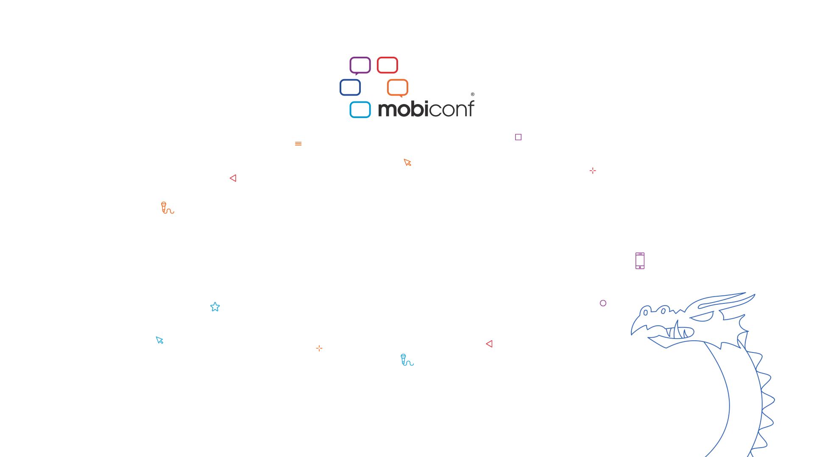
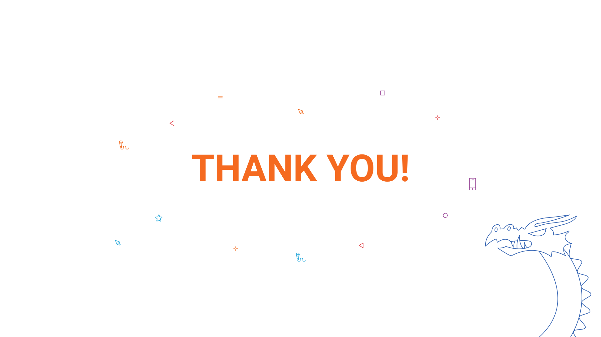

Theme: Business Class
text: Roboto, #53585F
text-strong: Roboto Bold, #EE783F
text-emphasis: Roboto Light Italic
header: Roboto, #53585F
header-strong: Roboto Strong,#EE783F
header-emphasis: Reklame Script, #53585F  
code: Fira Code Medium, #EE783F, #8B3D90, #2E59A2, #DF393F, #1EA8D9
background-color: #FFFFFF  
table-separator-color: #DDDEE0
footer: **#mobiconf2017** MOBICONF.ORG **|** 5-6 OCTOBER  2017
slidenumbers: true

# **Title text** </br> Subtitle

[.slidenumbers: false]


---
# Hi, I'm **Mateusz** 👋 <br/><br/>
##  [@cojoj](https://twitter.com/cojoj)
##  https://example.com 
##  example@example.com


---
# Roboto **Roboto** _Test_

We love our users, _we really do_! **Sometimes**, when we get really excited about something, we might forget to check whether what we do actually is for them or for us.


---
# Code snippet

```swift
import UIKit

protocol StoryboardIdentifiable {
    static var storyboardIdentifier: String { get }
}

extension StoryboardIdentifiable where Self: UIViewController {
    static var storyboardIdentifier: String {
        return String(describing: self)
    }

    func testFunction() -> String? {
        // We have ligatures here 🔥
        a != b
    }
}
```


---
# Devices


You can also use **device templates**!

+ `assets/iphone.png`
+ `assets/samsung.png`
+ `assets/nexus.png`

---
# Maybe **table**?

| Tables        | Are           | Cool  |
| ------------- |:-------------:| -----:|
| col 3 is      | right-aligned | $1600 |
| col 2 is      | centered      |   $12 |
| zebra stripes | are neat      |    $1 |


---
# Let's go, list!

1. **Something**
1. Else
    1. Something
    1. Something
        1.1 _Something_
    1. Something


---
[.slidenumbers: false]


---
[.slidenumbers: false]
